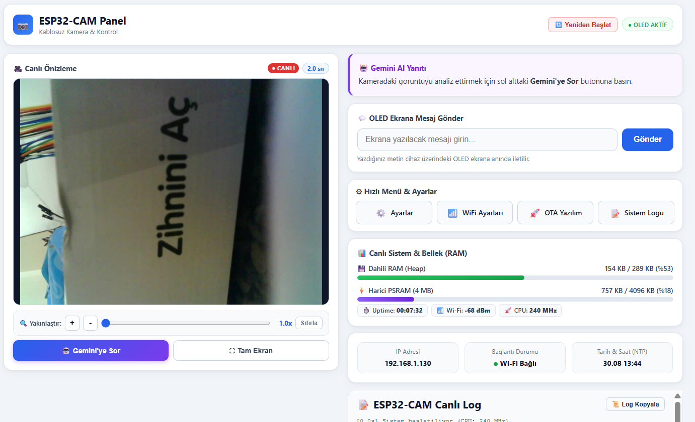
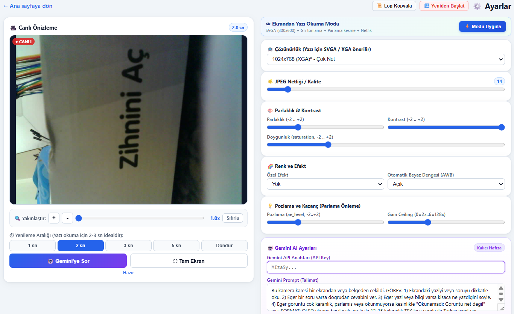
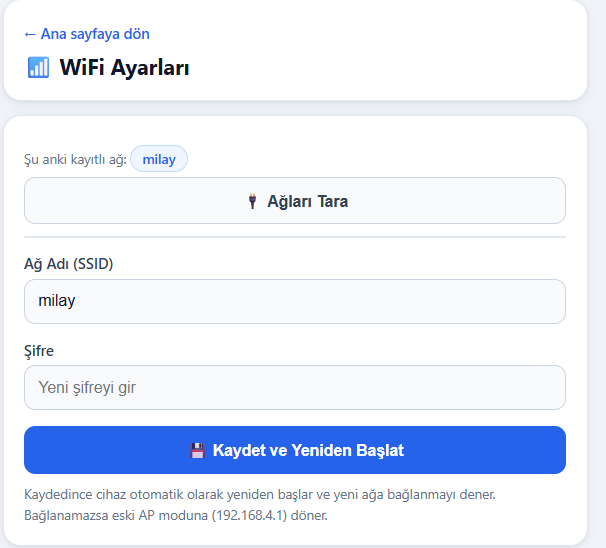
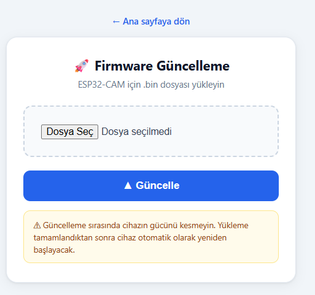
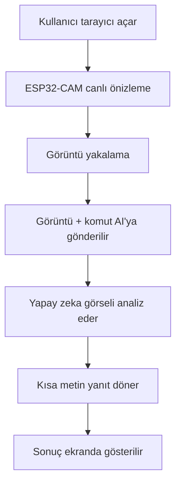
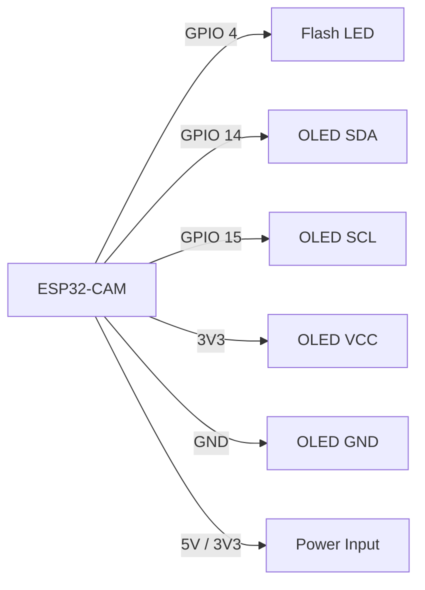

# ESP32-CAM Kamera Projesi

ESP32-CAM tabanlı küçük bir kamera projesi. Wi‑Fi ağına bağlanır, canlı görüntü gösterir ve yakalanan kareleri yapay zeka ile yorumlatmaya uygun şekilde kullanılabilir.

<p align="center">
  
</p>

## Screenshots

<p align="center">
  
</p>

### Görüntü Galerisi

<p align="center">
  
</p>

<p align="center">
  
</p>

## Genel Bakış

Bu proje, küçük bir ESP32-CAM modülünü hızlı şekilde test etmek için tasarlanmıştır. Yerel ağ üzerinden canlı akış sağlar, görüntü yakalar ve istenirse Gemini veya OpenAI benzeri bir yapay zeka modeliyle entegre edilir. Ana akış şu şekildedir: kamera kareyi yakalar, görseli AI modeline gönderir ve kısa bir metin cevabı geri alır.

## Özellikler

- Tarayıcı üzerinden canlı kamera görünümü
- Görüntü yakalama
- Yapay zeka destekli görsel yorumlama
- Gemini/OpenAI benzeri analiz akışı
- Wi‑Fi istemci modu
- Erişim noktası modu
- OTA güncelleme desteği
- Arduino tabanlı yapı
- Basit donanım ve yazılım entegrasyonu

## Yapay Zeka Entegrasyon Mantığı

Kamera kartı, görseli toplayan hafif bir cihaz görevi görür; yorumlama işlemini yapay zeka modeli üstlenir.

Tipik akış:

1. ESP32-CAM bir JPEG görseli yakalar.
2. Görsel, HTTPS istek ile arka uç veya doğrudan model uç noktasına gönderilir.
3. İstek içinde API anahtarı ve kısa bir komut bulunur.
4. Model görseli analiz eder ve kısa bir Türkçe veya İngilizce açıklama döndürür.
5. Sonuç web sayfasında veya OLED ekranda gösterilir.

Örnek istek mantığı:

```cpp
// Sadece kavramsal örnek
String payload = "{\n"
  "  \"contents\": [{\n"
  "    \"parts\": [\n"
  "      {\"text\": \"Gorseldeki metni oku ve kisa cevap ver.\"},\n"
  "      {\"inline_data\": {\"mime_type\": \"image/jpeg\", \"data\": \"BASE64_GORSEL\"}}\n"
  "    ]\n"
  "  }]\n"
  "}";
```

OpenAI benzeri API'lerde aynı mantık geçerlidir: görsel ve komut birlikte gönderilir, JSON yanıtı alınır, metin alanı ayrıştırılır ve ekranda gösterilir. Uygulama doğrudan ESP32 üzerinden HTTP istemcisiyle yapılabileceği gibi, daha kararlı yükleme ve yanıt yönetimi için küçük bir arka uç da kullanılabilir.

## Kullanıcı Dostu Kullanım Senaryosu

Tipik kullanım akışı şöyle görünür:

1. Kullanıcı tarayıcıdan kamera sayfasını açar.
2. Cihaz canlı görünümü gösterir.
3. Kullanıcı görüntü yakalama butonuna basar.
4. Görsel, "Bu metni oku ve kısa cevap ver" gibi bir komutla AI modeline gönderilir.
5. Model kısa bir sonuç döner.
6. Cevap web arayüzünde veya ekranda gösterilir.

Bu kullanım alanları için uygundur:

- basılı döküman okuma
- tabela veya etiket yorumlama
- ekranda görülen sorunun çözümü
- küçük gömülü sistemlerde hızlı görsel kontrol

## Capture → Analyze → Response Akışı



## Proje Yapısı

```text
.
├── README.md
├── read_me.md
├── seo.ino
├── seo_example.ino
├── seo_github.ino
├── arkaplan.png
└── diğer proje dosyaları
```

## Donanım Gereksinimleri

- ESP32-CAM AI-Thinker kartı
- USB-TTL programlayıcı
- 3.3V güç kaynağı
- İsteğe bağlı OLED ekran
- Jumper kablolar ve breadboard

## Pin Haritası

```cpp
#define PWDN_GPIO_NUM     32
#define RESET_GPIO_NUM    -1
#define XCLK_GPIO_NUM      0
#define SIOD_GPIO_NUM     26
#define SIOC_GPIO_NUM     27

#define Y9_GPIO_NUM       35
#define Y8_GPIO_NUM       34
#define Y7_GPIO_NUM       39
#define Y6_GPIO_NUM       36
#define Y5_GPIO_NUM       21
#define Y4_GPIO_NUM       19
#define Y3_GPIO_NUM       18
#define Y2_GPIO_NUM        5
#define VSYNC_GPIO_NUM    25
#define HREF_GPIO_NUM     23
#define PCLK_GPIO_NUM     22
```

## Bağlantı Örneği



## Başlangıç

### 1. Gerekli araçlar

- Arduino IDE
- ESP32 kart desteği
- Gerekli kütüphaneler:
  - `ESP32 by Espressif`
  - `WebServer`
  - `ArduinoOTA`

### 2. Wi‑Fi ayarlarını yapılandırma

Sketç içindeki ağ bilgilerini kendi ortamınıza göre düzenleyin:

```cpp
String sta_ssid     = "YOUR_WIFI_SSID";
String sta_password = "YOUR_WIFI_PASSWORD";
```

### 3. AI ayarlarını ekleme

Kullandığınız modelin API anahtarını ve prompt metnini güvenli şekilde ekleyin. Kişisel anahtarları GitHub gibi halka açık alanlara doğrudan yazmayın.

```cpp
String gemini_api_key = "YOUR_API_KEY";
String gemini_prompt  = "Gorseldeki metni oku ve kısa cevap ver.";
```

### 4. Kodu yükleme

1. `seo_github.ino` dosyasını Arduino IDE’de açın.
2. Doğru ESP32-CAM kart modelini seçin.
3. Seri portu seçin.
4. Yüklemeyi başlatın.

## Kullanım

1. Kartı güç kaynağına bağlayın.
2. Seri monitörü açın.
3. Çıkan IP adresini not alın.
4. Tarayıcıda şu adrese gidin:

```text
http://<ESP32_IP>
```

5. Canlı görünümü izleyin.
6. Görüntü yakalayın.
7. AI analizi tetikleyin.
8. Gelen kısa sonucu kontrol edin.

## Notlar

Bu proje geliştirme, prototip ve öğrenme amaçlıdır. Üretim ortamında kullanmadan önce ağ güvenliği, kimlik bilgisi yönetimi, API kullanım limitleri ve erişim kontrolü mutlaka gözden geçirilmelidir.

## Lisans

Bu proje eğitim ve kişisel kullanım için sunulmuştur. Kendi projelerinizde faydalanabilirsiniz; ancak özel ağ bilgileri, kimlik bilgileri ve hassas ayarlar herkese açık alanlarda paylaşılmamalıdır.

## Geliştirme Fikirleri

- daha modern web arayüzü
- kamera ayar paneli
- çözünürlük ve kalite kontrolü
- hareket algılama
- yerel loglama
- AI yanıt önbelleği
- güvenli arka uç relay katmanı

